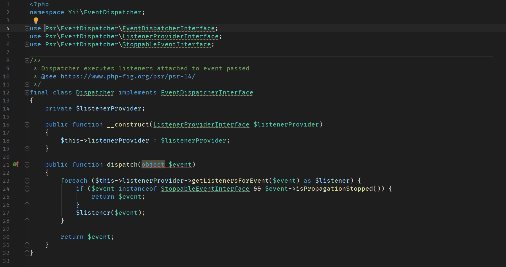

# Visual Studio Code Dark Plus color scheme for JetBrains IDEs

Visual Studio Code Dark Plus-like color scheme for PhpStorm and other JetBrains IDEs.

## Screenshot

That is how it looks with Fira Code font:

## Installation

1. Clone repository or download `Visual Studio Code Dark Plus.icls`
1. Settings → Editor → Color Scheme
2. Click on the gear icon
3. Import Scheme...
4. Select `Visual Studio Code Dark Plus.icls`
